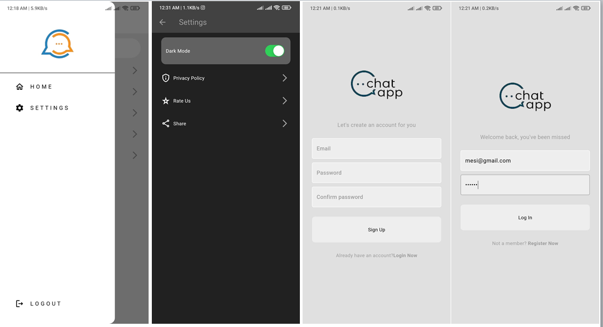
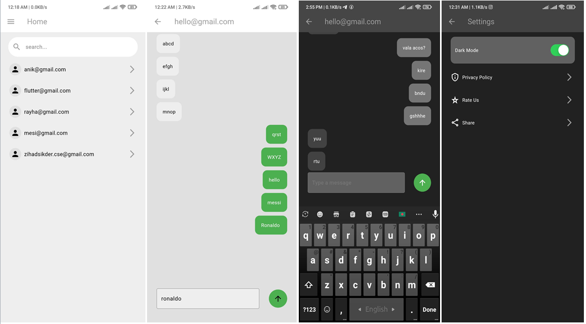

# Flutter ChatApp

A Flutter application to chat people each others.

## Features

- Using firebase database & authentication.
- Real time chat functionality.
- Responsive and clean UI design
- State management using GetX

## Play store Link(available on after 25th August, 2024)

[Download the APK](https://play.google.com/store/apps/details?id=com.islandit.chat.app)

## screenshots

<<<<<<< HEAD


=======


>>>>>>> c92e90904d5de1f1ad20cac3cb39c775d7a4d611


## Getting Started

### Prerequisites

- Flutter SDK: [Install Flutter](https://flutter.dev/docs/get-started/install)
- An IDE such as VSCode or Android Studio

### Installation

1. **Clone the repository:**

   ```sh
   git clone https://github.com/zihadsikder/chat_app
   cd chat_app

